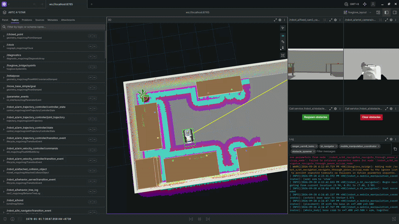
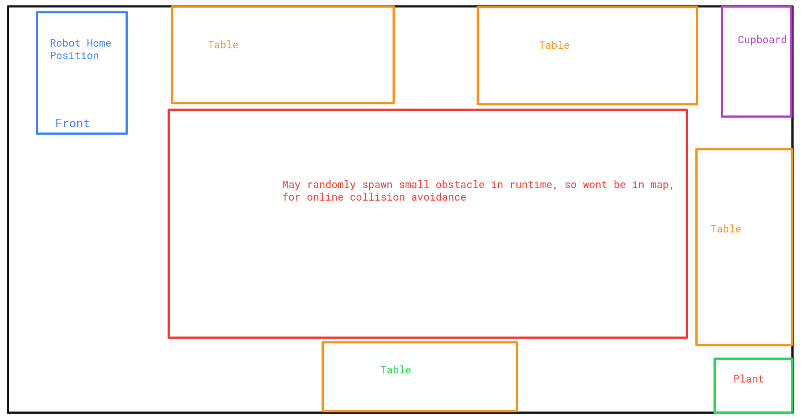
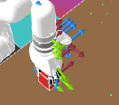

# artc_ranger_xarm6

Robot-platform packages for the **Ranger Mini 3.0 (AgileX / Weston Robot) + xArm6** mobile manipulator, built for ARTC. This repo holds the combined URDF/xacro description, Gazebo simulation bringup, and real-hardware bringup — everything needed to get the robot moving in sim or on real hardware, independent of any particular control algorithm.


  


Application code (e.g. [wbcc_mm](https://github.com/artc-asr/whole_body_compliance_control_mm), the whole-body compliance controller) lives in a separate repo and pulls this one in as a dependency, the same way this repo pulls in the vendor description/driver packages below.

## Contents

| Package | Description |
|---|---|
| `ranger_xarm6_description` | Combined description + bringup launch. Joins the base and arm through a fixed mount transform; `ranger_xarm6.launch.py` supports both Gazebo Harmonic simulation and real hardware (`sim:=true/false`). |
| `ranger_xarm6_moveit_config` | MoveIt 2 config: the base as `base_x/y/theta` joints (crab and spin never mixed), the arm, and `whole_body`. |
| `ranger_xarm6_manipulation` | MoveIt-based base + arm control (sequential or whole-body), `MoveToGoal` action. See its [README](ranger_xarm6_manipulation/README.md). |
| `ranger_xarm6_navigation` | Odometry (EKF over wheel odometry + the Mid-360's IMU), FAST-LIO2 3D mapping with the front D435i's low obstacles, the 2D grid, NDT scan-to-map localization against the 3D map, and Nav2 (lidar + front D435i costmaps, collision monitor). See its [README](ranger_xarm6_navigation/README.md). |
| `ranger_xarm6_tasks` | Tasks as behavior trees (BehaviorTree.CPP v4), edited in Groot2 and watched live in klein-bt: taught waypoints and arm poses, steps over Nav2, MoveIt and the gripper, run by name. See its [README](ranger_xarm6_tasks/README.md). |
| `ranger_xarm6_bringup` | The whole sim stack in one launch (`sim.launch.py`: robot, Nav2, MoveIt, tasks, started as each is ready), viewed in Foxglove and klein-bt. See its [README](ranger_xarm6_bringup/README.md). |
| `BehaviorTree.ROS2` (submodule, `humble` branch) | BehaviorTree.CPP's ROS 2 layer: the task server (`TreeExecutionServer`, `ExecuteTree` action). |
| `ranger_mini_v3_description` | Vendored — missing from upstream `ranger_ros2` for ROS 2 Humble at the time this was ported. |
| `xarm_ros2` (submodule) | UFACTORY xArm6 description, ros2_control, and driver packages. |
| `westonrobot_ranger_ros2` (submodule) | Ranger Mini 3.0 real-hardware bringup/driver. |
| `ugv_sdk` (submodule) | Weston Robot UGV SDK — `ranger_ros2`'s driver dependency. |
| `gz_ros2_control` (submodule, `humble` branch) | Built from source with `GZ_VERSION=harmonic` (see below) — the `ros-humble-gz-ros2-control` **apt** package is built against Fortress (`libignition-gazebo6`) regardless of what's installed locally, so on a Harmonic system its plugin exports the wrong ABI symbol (`IgnitionPluginHook` instead of `GzPluginHook`) and Gazebo silently fails to load it, which cascades into `controller_manager` never starting and `joint_state_broadcaster`/`arm_velocity_controller` never spawning. Building this submodule locally (the main `colcon build` below already does, since `GZ_VERSION=harmonic` is exported first) overlays a correctly-linked version. |
| `Livox-SDK2` (submodule) | Livox's low-level lidar SDK (Mid-360 support). No apt package exists; built from source to a **user-writable prefix** (`$HOME/.local`, not `/usr/local` via `sudo make install` as Livox's own README suggests) — see below. |
| `FAST_LIO` (submodule, `ROS2` branch) | FAST-LIO2 lidar-inertial odometry/mapping (hku-mars), used by `ranger_xarm6_navigation`'s mapping. Has its own `ikd-Tree` submodule (`--recurse-submodules` fetches it). |
| `lidar_localization_ros2` (submodule) | NDT scan-to-map localization (rsasaki0109), `ranger_xarm6_navigation`'s `localization:=ndt`: only its NDT core is used (no IMU preintegration or smoother). |
| `ndt_omp_ros2` (submodule, `humble` branch) | Multithreaded NDT for `lidar_localization_ros2`. |
| `livox_ros_driver2` (submodule) | ROS 2 driver for the Mid-360, built against `Livox-SDK2` above. Its `package.xml` is intentionally **not** committed upstream (gitignored in that submodule, since the same source tree serves both ROS1 and ROS2 via templated `package_ROS1.xml`/`package_ROS2.xml`) — regenerate it after every fresh clone, see below. |

## Installation

> **Note:** targets **ROS 2 Humble / Ubuntu 22.04**, paired with **Gazebo Harmonic** (not the default Fortress pairing for Humble).

```bash
# Clone
cd ~/Worksplace
git clone --recurse-submodules git@github.com:artc-asr/artc_ranger_xarm6.git
cd artc_ranger_xarm6

# Gazebo Harmonic (OSRF apt repo — Harmonic isn't in Ubuntu 22.04's default archives)
sudo apt-get update && sudo apt-get install curl lsb-release gnupg
sudo curl https://packages.osrfoundation.org/gazebo.gpg --output /usr/share/keyrings/pkgs-osrf-archive-keyring.gpg
echo "deb [arch=$(dpkg --print-architecture) signed-by=/usr/share/keyrings/pkgs-osrf-archive-keyring.gpg] http://packages.osrfoundation.org/gazebo/ubuntu-stable $(lsb_release -cs) main" | sudo tee /etc/apt/sources.list.d/gazebo-stable.list > /dev/null
sudo apt-get update && sudo apt-get install gz-harmonic

# ROS dependencies
# WARNING: ros-humble-ros-gz* conflicts with ros-humble-ros-gzharmonic — remove it first if installed.
sudo apt-get remove -y 'ros-humble-ros-gz*' || true
sudo apt install ros-humble-ros-gzharmonic

# Camera drivers + description packages (RealSense D435i x2, Orbbec Gemini 2 on the wrist)
sudo apt-get install -y \
  ros-humble-realsense2-description ros-humble-realsense2-camera \
  ros-humble-orbbec-description ros-humble-orbbec-camera

# Navigation: robot_localization (EKF), pcl_ros (FAST-LIO); rosdep below also finds them
sudo apt-get install -y ros-humble-robot-localization ros-humble-pcl-ros

# Tasks: BehaviorTree.CPP v4 (installs next to Nav2's v3)
sudo apt-get install -y ros-humble-behaviortree-cpp

rosdep install --from-paths . --ignore-src -r -y \
  --skip-keys "gz_sim_vendor sdformat_vendor gz_transport_vendor gz_msgs_vendor"

# Livox-SDK2 (Mid-360 lidar): no apt package, build from source. Installed to
# $HOME/.local (NOT /usr/local via sudo make install, as Livox's own README
# suggests) so the rest of this setup needs no sudo; livox_ros_driver2's
# CMakeLists.txt hardcodes /usr/local/lib as a find_library() HINT but still
# also searches CMAKE_PREFIX_PATH (passed to colcon build below), which is
# how it's actually found.
cmake -S Livox-SDK2 -B Livox-SDK2/build -DCMAKE_INSTALL_PREFIX=$HOME/.local -DCMAKE_BUILD_TYPE=Release
cmake --build Livox-SDK2/build -j$(nproc)
cmake --install Livox-SDK2/build

# livox_ros_driver2's package.xml is gitignored upstream (see Contents table
# above) -- regenerate it from the ROS2 template before every fresh clone's
# first build.
cp livox_ros_driver2/package_ROS2.xml livox_ros_driver2/package.xml

# Build
export GZ_VERSION=harmonic
colcon build --cmake-args -DCMAKE_BUILD_TYPE=Release -DROS_EDITION=ROS2 -DDISTRO_ROS=humble \
  -DCMAKE_PREFIX_PATH=$HOME/.local \
  --packages-skip xarm_moveit_servo xarm_planner btcpp_ros2_samples \
  gz_ros2_control_demos gz_ros2_control_tests ign_ros2_control ign_ros2_control_demos \
  --allow-overriding gz_ros2_control

# Source
source install/setup.bash
```

> **Note:** `xarm_moveit_servo`/`xarm_planner` are skipped — `xarm_moveit_servo` fails to build against Humble's older `moveit_msgs` (missing `servo_command_type.hpp`, a newer MoveIt Servo API only present from Jazzy+).
>
> **Note:** don't run `livox_ros_driver2/build.sh` directly — it assumes the
> `ws_livox/src/livox_ros_driver2` layout from Livox's own clone
> instructions and does `rm -rf ../../build/` etc. as a "clean slate" step,
> which in this flat-submodule layout resolves to this **entire repo's**
> `build/` directory. The steps above do the same substitution
> (`package_ROS2.xml` -> `package.xml`) safely, without that.
>
> **Note:** `gz_ros2_control_demos`/`gz_ros2_control_tests`/`ign_ros2_control`/`ign_ros2_control_demos` (siblings of `gz_ros2_control` inside that same submodule) are skipped too — only `gz_ros2_control` itself is needed here (see the Contents table above for why it's built from source at all), and the demo/test packages pull in extra controller deps (`control_toolbox`, `ackermann_steering_controller`, `mecanum_drive_controller`, `tricycle_controller`, ...) this repo doesn't otherwise need.

## Usage guide

Everything below is for the simulation unless it says otherwise; the
real-robot differences are at the end of each part. The robot's ROS
namespace and frame prefix is `robot_a` throughout (`robot_id` launch
argument). Tested in sim on 2026-09-27; real hardware is untested.

### 0. Every terminal

```bash
cd ~/Worksplace/artc_ranger_xarm6 && source install/setup.bash
export RMW_IMPLEMENTATION=rmw_cyclonedds_cpp
```

Use the same `RMW_IMPLEMENTATION` in **every** terminal of a session
(mixing them breaks communication). Cyclone is recommended: with the
default FastDDS, Nav2 hung at startup in 2 of 8 launches (a lost
lifecycle response), with Cyclone 0 of 8. If a FastDDS session misbehaves
after something crashed, run `fastdds shm clean`.

After pulling changes, rebuild what changed, e.g.
`colcon build --packages-select ranger_xarm6_description ranger_xarm6_navigation ranger_xarm6_manipulation ranger_xarm6_moveit_config`.

**All at once**: `ros2 launch ranger_xarm6_bringup sim.launch.py` starts
everything in sections 1-6 (robot, Nav2, MoveIt, tasks), with Foxglove
and klein-bt instead of the RViz windows; see
[ranger_xarm6_bringup](ranger_xarm6_bringup/README.md). The sections
below start the pieces one terminal at a time.

### 1. Start the robot



**Terminal 1** (keep it running for everything below):

```bash
ros2 launch ranger_xarm6_description ranger_xarm6.launch.py \
  world:=artc_lab.world x:=0.94 y:=4.35 yaw:=-1.5708
```

- Gazebo runs headless (`gz_gui:=true` shows its window); RViz shows the
  room, the robot and its sensors. Mapping uses this RViz; Nav2 and
  MoveIt each bring their own, so add `run_rviz:=false` for those.
- `x y yaw` is the spawn pose: `0.94 4.35 -1.5708` is the robot's home
  spot in `artc_lab` (the maps in this guide assume it).
- **The base drives on its wheels** (`base_drive:=physics`, the default):
  `ranger_sim_base.py` turns `cmd_vel` into the 4 steering angles and
  wheel speeds (`gz_ros2_control`), with the real driver's motion modes:
  crab when `linear.y` isn't 0, spin in place when the turn radius is
  under 0.476 m (`linear.x` is then ignored, as on the robot), dual
  Ackermann otherwise. So it slips, steers before it drives, and stops at
  walls; `odom` is wheel odometry from what the wheels did, and TF
  `odom -> base_link` is Gazebo's true pose. `base_drive:=kinematic` is
  the old base, teleported exactly along `cmd_vel` (`base_pose_publisher.py`).
- **Random obstacles** for collision-avoidance tests: add
  `random_obstacles:=5` (and `obstacle_seed:=7` to get the same layout
  again; the seed used is printed in this terminal). They go in the
  room's open area (the red area of `screenshots/world_plan_view.png`), so they're not
  in the map, and they're drawn in RViz. Re-roll or remove them any time:

  ```bash
  ros2 run ranger_xarm6_description spawn_obstacles.py --count 5          # a new layout
  ros2 run ranger_xarm6_description spawn_obstacles.py --count 5 --seed 7 # that layout again
  ros2 run ranger_xarm6_description spawn_obstacles.py --clear
  ```

- **Park the arm before driving** (`stow` or `home`, see section 4): the
  base's footprint, which Nav2 and the collision monitor use, covers the
  arm only in those poses.
- Drive by hand (any time the base isn't under Nav2 or MoveIt):
  `ros2 run teleop_twist_keyboard teleop_twist_keyboard --ros-args -r cmd_vel:=/robot_a/cmd_vel`.

Real robot: `sim:=false robot_ip:=<xArm IP> can_device:=can0
fixed_cam1_serial:=<front D435i serial> fixed_cam2_serial:=<rear>` instead
of the world/spawn arguments, plus `publish_odom_tf:=false` when the EKF
runs (section 2).

### 2. Mapping

Builds the map that navigation uses: a 3D point cloud from FAST-LIO2 (the
Mid-360 lidar + its IMU), plus the front RealSense's low obstacles, then
a 2D grid from both.

**In sim you can skip this** if you have `~/ranger_xarm6_maps/artc_lab.*`
(the lab's map; it lives on the computer that made it, not in this repo:
copy it over, or map once with the steps below and `map:=~/ranger_xarm6_maps/artc_lab.pcd`).
Map again for a new world or layout.

1. Terminal 1: the robot (section 1), **without** `random_obstacles`
   (anything present while mapping ends up in the map).
2. Terminal 2, start mapping (pick the file name):

   ```bash
   ros2 launch ranger_xarm6_navigation mapping.launch.py map:=~/ranger_xarm6_maps/lab.pcd
   ```

3. Terminal 3, drive the robot round the room with teleop (above).
   - Slowly, and ramp speed up and down (no instant full-speed starts).
   - Arm parked. An arm reaching out while mapping gets mapped.
   - Point the front camera at low things (boxes, chair legs, bins): the
     lidar can't see what's low and close, the camera records it.
   - Finish where you started (a closed loop keeps the map consistent).
   - To watch the map grow, add a PointCloud2 display on
     `/robot_a/fast_lio/laser_map` in terminal 1's RViz.
4. Save the 3D map, then stop mapping (Ctrl-C in terminal 2; the low
   obstacles are written on exit):

   ```bash
   ros2 service call /robot_a/map_save std_srvs/srv/Trigger
   ```

   Result: `lab.pcd` (lidar map) and `lab_depth.pcd` (camera's low obstacles).
5. Make the 2D grid for Nav2:

   ```bash
   ros2 run ranger_xarm6_navigation pcd_to_grid.py ~/ranger_xarm6_maps/lab.pcd \
     --origin 0.917 4.177 0.793 1.5708
   ```

   Result: `lab.pgm` + `lab.yaml`. `--origin` is where the lidar's IMU
   was when mapping started, in the map frame (x y z yaw, z = its height
   above the floor). The values above are for the sim's home spawn; for
   another spawn, see [2D grid](ranger_xarm6_navigation/README.md#2d-grid).
   Open `lab.pgm` in any image viewer to check it: black = obstacle,
   white = free, grey = unknown.

Real robot: the robot with `publish_odom_tf:=false`, the EKF, then the
same steps with `use_sim_time:=false`:

```bash
ros2 launch ranger_xarm6_navigation odometry.launch.py use_sim_time:=false
ros2 launch ranger_xarm6_navigation mapping.launch.py use_sim_time:=false map:=~/ranger_xarm6_maps/lab.pcd
```

For the grid, `--origin 0 0 <IMU height above the floor> 0` makes the map
frame where mapping started. The Mid-360 must be PTP time-synced with the
computer.

### 3. Navigation (Nav2)

Drives the base to a goal on the map, avoiding what the lidar and the
front RealSense see on the way.

```bash
# Terminal 1: the robot (section 1), e.g. with run_rviz:=false random_obstacles:=5
# Terminal 2:
ros2 launch ranger_xarm6_navigation navigation.launch.py map:=~/ranger_xarm6_maps/artc_lab.yaml
```

Wait until terminal 2 has printed `Managed nodes are active` **twice**
(about 10-20 s). Then, in its RViz:

- **2D Goal Pose** (toolbar): click where the robot should go and drag
  the arrow for the direction it should face.
- What you see: the map, the global costmap and local costmap (obstacles
  and their inflation), the planned path, the robot, the room and any
  spawned boxes, and a red outline: the footprint the collision monitor
  checks.

From a terminal (coordinates in the map frame; in sim = Gazebo's world,
the room is x 0..10, y 0..5.2; orientation `z, w` = sin, cos of half the
heading):

```bash
ros2 action send_goal /robot_a/navigate_to_pose nav2_msgs/action/NavigateToPose \
  "{pose: {header: {frame_id: robot_a_map}, pose: {position: {x: 7.5, y: 2.5}, orientation: {z: 0.0, w: 1.0}}}}"
```

Headings: `{z: 0.0, w: 1.0}` +x (east), `{z: 0.707, w: 0.707}` +y,
`{z: 1.0, w: 0.0}` -x, `{z: -0.707, w: 0.707}` -y. Ctrl-C the command to
cancel the goal.

How it behaves:
- The base spins in place towards the path, drives forward along it
  (never backwards, never sideways), then spins to the goal heading; 0.3
  m/s, 0.4 rad/s; the goal counts as reached within 10 cm / 6 deg.
- Obstacles not in the map are avoided: the lidar sees tall ones from
  far, the front RealSense low ones within 3 m ahead.
- The **collision monitor** slows and stops the base on its own when a
  command would hit something within 1.2 s, whatever Nav2 thinks.
- Keep goals ~0.7 m from obstacles: the base turns in place and needs
  the room. A goal it can't turn at, or that overlaps an obstacle,
  **aborts** rather than hitting something; send another goal.
- Don't send a MoveIt goal (section 4) while a Nav2 goal runs: both drive
  the base.
- While Nav2 runs, MoveIt's base motions go through the collision monitor
  too (`base_trajectory_server`'s `collision_monitor` parameter: auto /
  never / always). Docking under a tabletop needs `never`: the monitor's
  2D footprint calls that a collision (the task nodes set it per step).

Real robot: not yet. Navigation needs a localizer (map -> odom) that
isn't built; in sim a fixed map -> odom stands in, since the sim's odom
is exact.

More: [ranger_xarm6_navigation/README.md](ranger_xarm6_navigation/README.md)
(costmaps, collision monitor, test results, known gaps).

### 4. Arm and base with MoveIt

`ranger_xarm6_manipulation` moves the arm, the base, or both, planned by
MoveIt with collision checking against the room (tables, walls, cupboard).
One action does everything: `/robot_a/mobile_manipulation/move_to_goal`.

```bash
# Terminal 1: the robot (section 1) with run_rviz:=false
# Terminal 2 (MoveIt + its RViz):
ros2 launch ranger_xarm6_manipulation control.launch.py controller:=moveit_sequential
#   or controller:=moveit_whole_body  (only sets the default mode; each goal can pick)
```

Wait for `Arm named states: [...]` in terminal 2. Things to know:

- The arm is mounted at the **back** of the base, facing backwards: it
  reaches things **behind** the robot (-x of `robot_a_base_link`). To
  work at a table, the robot's back faces the table.
- The base either **crabs** (moves in any direction without turning) or
  **spins** in place, never both at once.
- **Sequential** (`mode: 1`): arm to a safe pose (`stow`) -> base crabs to
  x, y -> base spins to theta -> arm to its goal. One thing at a time.
- **Whole body** (`mode: 2`): base spins to theta first if needed, then
  the base crabs and the arm moves **together** in one plan.
- Named arm poses: `home` (all joints 0), `stow` (folded low behind the
  sensor tower, for driving).
- Coordinates are in `robot_a_odom` (in sim = the room/Gazebo frame) or
  `robot_a_base_link` (relative to where the base **ends up**).
- `-f` on `ros2 action send_goal` prints progress (which stage runs);
  Ctrl-C cancels.

#### 4.1 Sequential examples

Drive to a spot, then put the arm in a named pose:

```bash
ros2 action send_goal -f /robot_a/mobile_manipulation/move_to_goal ranger_xarm6_manipulation/action/MoveToGoal \
  "{mode: 1, move_base: true, base_goal: {x: 3.2, y: 2.6, theta: 1.5708}, move_arm: true, arm_named_goal: home}"
```

Only the arm (the base stays): `{mode: 1, move_arm: true, arm_named_goal: stow}`.
Only the base: `{mode: 1, move_base: true, base_goal: {x: 3.2, y: 2.6, theta: 0.0}}`
(the arm stows first; `transit_state: home` to carry it in `home` instead).
Slower: add `velocity_scaling: 0.1` (0-1; default 0.3).

#### 4.2 Moving to a new pose (not a named one)

Give the gripper's target pose (`link_tcp`, the point between the
fingertips) as `arm_pose_goal`. MoveIt finds the arm joints for it (IK),
checks collisions, and plans.

Position: where the fingertips should be. Orientation: a quaternion; for
the gripper pointing straight **down**:

| Gripper down, rotated about vertical by | orientation `{x, y, z, w}` |
|---|---|
| 0 deg | `{x: 1.0, y: 0.0, z: 0.0, w: 0.0}` |
| 90 deg | `{x: 0.707, y: 0.707, z: 0.0, w: 0.0}` |
| 180 deg | `{x: 0.0, y: 1.0, z: 0.0, w: 0.0}` |
| -90 deg | `{x: 0.707, y: -0.707, z: 0.0, w: 0.0}` |

Other orientations: `python3 -c "from tf_transformations import
quaternion_from_euler as q; import math; print(q(math.pi, 0, math.radians(45)))"`
(roll, pitch, yaw -> x, y, z, w).

**Relative to the base** (e.g. 10 cm lower than now). Read where the
gripper is, then send a changed pose:

```bash
ros2 run tf2_ros tf2_echo robot_a_base_link robot_a_link_tcp     # Translation = x y z now
ros2 action send_goal -f /robot_a/mobile_manipulation/move_to_goal ranger_xarm6_manipulation/action/MoveToGoal \
  "{mode: 1, move_arm: true, arm_pose_goal: {header: {frame_id: robot_a_base_link},
    pose: {position: {x: -0.43, y: 0.0, z: -0.20}, orientation: {x: 0.0, y: 1.0, z: 0.0, w: 0.0}}}}"
```

**In the room** (`robot_a_odom`), e.g. 5 cm above `cube_4` on the
north-east table (at 7.4, 4.12; tabletop 0.75 m), with the base put
where the arm reaches it, back to the table (whole body, section 4.3):

```bash
ros2 action send_goal -f /robot_a/mobile_manipulation/move_to_goal ranger_xarm6_manipulation/action/MoveToGoal \
  "{mode: 2, move_base: true, base_goal: {x: 7.4, y: 3.58, theta: -1.5708},
    move_arm: true, arm_pose_goal: {header: {frame_id: robot_a_odom},
    pose: {position: {x: 7.4, y: 4.12, z: 0.85}, orientation: {x: 0.0, y: 1.0, z: 0.0, w: 0.0}}}}"
```

To find coordinates: in sim, the world file
(`ranger_xarm6_description/worlds/artc_lab.world`; `generate_artc_lab.py`
lists the tables and cubes) or the spawn log of random obstacles; for
anything with a TF frame, `ros2 run tf2_ros tf2_echo robot_a_odom <frame>`.
Reach: with the gripper pointing down just above the tables, about 0.4 m
horizontally from the arm's base, i.e. the table edge must be close
behind the robot (the base stops 0.54 m from `cube_4` above).

If a goal fails, the message says why: `goal state is invalid ...: link_X
<-> world/table_...` = that pose would put the robot into the table;
`no IK solution` = out of reach or an impossible orientation.

**In RViz** (terminal 2's): in the MotionPlanning panel pick the
**Planning Group** `arm` (or `whole_body`), drag the interactive marker
at the gripper to the new pose, **Plan**, check the preview, **Execute**.

#### 4.3 Whole-body examples

Base and arm together, base pose given (above). **Base pose chosen for
you**: leave `move_base` out; the coordinator finds the nearest base
position, at the **current heading**, from which the arm reaches the pose.
It works when the robot's back already faces the target, e.g. after the
goal above, 5 cm above `cube_3`:

```bash
ros2 action send_goal -f /robot_a/mobile_manipulation/move_to_goal ranger_xarm6_manipulation/action/MoveToGoal \
  "{mode: 2, move_arm: true, arm_pose_goal: {header: {frame_id: robot_a_odom},
    pose: {position: {x: 6.5, y: 4.10, z: 0.85}, orientation: {x: 0.0, y: 1.0, z: 0.0, w: 0.0}}}}"
```

(If the robot faces the table instead, this fails with the base in the
table: give `move_base: true` and a `base_goal` with its back to it.)

#### 4.4 Saving a new named pose

To reuse a pose by name (like `home`, `stow`):

1. Move the arm there (a pose goal, or RViz drag + Execute).
2. Print it as an SRDF entry:

   ```bash
   ros2 run ranger_xarm6_manipulation arm_joints.py pick_ready
   ```

   ```xml
     <group_state name="pick_ready" group="arm">
       <joint name="${prefix}joint1" value="0.6064" />
       ...
     </group_state>
   ```

3. Paste it into `ranger_xarm6_moveit_config/srdf/ranger_xarm6.srdf.xacro`,
   next to `home` and `stow`.
4. `colcon build --packages-select ranger_xarm6_moveit_config`, restart
   terminal 2 (it prints `Arm named states: ['home', 'pick_ready', 'stow']`).
5. Use it: `{mode: 1, move_arm: true, arm_named_goal: pick_ready}`, or as
   `transit_state`.

A named pose is joint angles, so it's the same arm shape wherever the
base is; a pose goal is a place in the room.

Real robot: the same, with `use_sim_time:=false` on `control.launch.py`.
Untested on hardware; the planning scene there has only the floor (no
tables) until perception exists.

### 5. Gripper

  


```bash
ros2 run ranger_xarm6_manipulation gripper.py open
ros2 run ranger_xarm6_manipulation gripper.py close
ros2 run ranger_xarm6_manipulation gripper.py 0.4        # partly: 0 (open) .. 0.85 (closed)
```

It prints where the fingers stopped: `drive_joint 0.831 (target 0.85)`;
`stopped short: holding something` when an object stops them. Works with
or without MoveIt running (the gripper has its own controller, not
MoveIt's).

The raw topic, for your own code (`std_msgs/Float64MultiArray`, one
value in rad):

```bash
ros2 topic pub -w 1 -t 3 /robot_a/gripper_position_controller/commands std_msgs/msg/Float64MultiArray "{data: [0.85]}"
```

(`-w 1 -t 3`: wait for the controller and send 3 times; a single
`--once` can be lost.)

As an action with a result (`control_msgs/GripperCommand`, position =
drive_joint in rad; `stalled` = holding something): `/robot_a/gripper_command`,
served by `gripper_action_server.py`, which `ranger_xarm6_tasks`'
`tasks.launch.py` starts.

Pick sequence (the steps; the grasp itself hasn't been tuned/tested in
sim): `gripper.py open` -> pose goal 5 cm above the cube (4.2) -> pose
goal lowering the fingertips to around the cube's middle (a 5 cm cube on
a 0.75 m table: z ~0.78) -> `gripper.py close` (should report `holding
something`) -> pose goal back up -> drive.

### 6. Tasks: behavior trees (Groot2, klein-bt)

Whole jobs ("drive to the table, turn the arm side to it, pick the cube,
carry it, put it down") as behavior trees: steps dragged together in
**Groot2**, saved as XML in `ranger_xarm6_tasks/trees/`, run by name.
Watched live in the browser with **klein-bt**. Waypoints and arm poses
are taught by putting the robot there and saving.

```bash
# Terminals 1-3: the robot (run_rviz:=false), Nav2 (section 3), MoveIt (section 4)
# Terminal 4:
ros2 launch ranger_xarm6_tasks tasks.launch.py
# then:
ros2 run ranger_xarm6_tasks run_task.py --list
ros2 run ranger_xarm6_tasks run_task.py DemoPickPlace       # Ctrl-C cancels
ros2 run ranger_xarm6_tasks save_waypoint.py <name>         # teach where the base is
ros2 run ranger_xarm6_tasks save_arm_pose.py <name>         # teach where the gripper is
klein-bt                                                    # watch it: http://localhost:8080
```

Groot2 and klein-bt setup, editing, live monitoring, every step type and the
example tasks: [ranger_xarm6_tasks/README.md](ranger_xarm6_tasks/README.md).

### 7. Troubleshooting

| Symptom | Cause / fix |
|---|---|
| Nav2 never prints `Managed nodes are active` twice | DDS startup race: Ctrl-C, relaunch; use Cyclone (section 0); `fastdds shm clean` after crashes |
| Nav2 goal aborts next to an obstacle | no room to turn in place, or the goal overlaps an obstacle: send a goal further away |
| `goal state is invalid ... <-> world/...` (MoveIt) | that pose puts the robot into something: other base pose / heading |
| MoveIt's RViz Plan/Execute does nothing (waits ~60 s) | the MotionPlanning panel's **Move Group Namespace** must be `/robot_a` (Displays -> MotionPlanning) |
| Gripper doesn't move | use `gripper.py`; check `ros2 control list_controllers -c /robot_a/controller_manager` shows `gripper_position_controller` active |
| Robot drifts / wrong pose after a crash in sim | restart terminal 1 (and everything on top) |
| A task is refused | another one runs (cancel it), or the name isn't a tree in `ranger_xarm6_tasks/trees/` (`run_task.py --list`); terminal 4 says which |
| A task step fails | terminal 4 names the step and the reason (e.g. `unknown waypoint`, MoveIt's message) |

## Using this repo from another workspace

Add it as a submodule (or a vcstool `.repos` entry) under your workspace's `src/`:

```bash
git submodule add git@github.com:artc-asr/artc_ranger_xarm6.git src/artc_ranger_xarm6
git submodule update --init --recursive
```

`colcon build` discovers all packages recursively, so no further wiring is needed.
