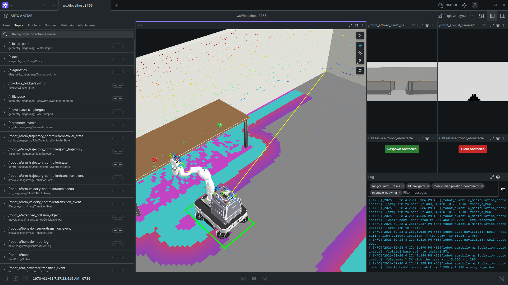
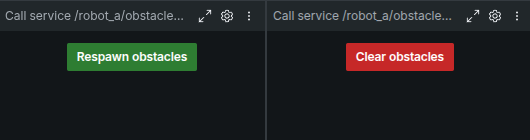

# ranger_xarm6_bringup

The whole sim stack in **one launch**, viewed in **Foxglove** (instead of
the separate RViz windows) and **klein-bt** (the running task).

```bash
ros2 launch ranger_xarm6_bringup sim.launch.py                        # ground-truth odom
ros2 launch ranger_xarm6_bringup sim.launch.py localization:=ndt      # EKF + NDT, as on hardware
# then, in another terminal:
ros2 run ranger_xarm6_tasks run_task.py DemoPickPlace
```

It replaces the repo README's four terminals (robot, Nav2, MoveIt, tasks).
Each stage starts once the one before is ready (`scripts/wait_for.py`
checks, not fixed delays):

| Stage | Starts | When |
|---|---|---|
| 1 | the robot in Gazebo, `foxglove_bridge` (port 8765), klein-bt (port 8080), the Foxglove app, the obstacle buttons' server | at once |
| 2 | Nav2 (+ the EKF and the NDT localizer with `localization:=ndt`) | the robot's controllers are active |
| 3 | MoveIt (`ranger_xarm6_manipulation`) | `bt_navigator` is active |
| 4 | the task layer (`ranger_xarm6_tasks`) | MoveIt's `move_to_goal` is up |

If a stage isn't ready in 5 minutes the launch says so and stops there.
Still one `RMW_IMPLEMENTATION` for every terminal (repo README, section 0).

## Setup (once)

```bash
sudo apt install ros-humble-foxglove-bridge
colcon build --packages-select ranger_xarm6_bringup
```

The Foxglove app (`foxglove-studio`, from https://foxglove.dev/download)
and klein-bt (`ranger_xarm6_tasks` README) are optional: without them the
launch says so and runs the rest.

**The layout**: in Foxglove, **Layouts -> Import from file** ->
`ranger_xarm6_bringup/config/foxglove_layout.json`. It has:

- a **3D** view following the robot: the robot model, the map, both
  costmaps, the footprint, Nav2's plan, the room (`world_markers`), the
  lidar, and with `localization:=ndt` the localizer's pose (`pcl_pose`).
  Its publish tool sends a **Nav2 goal** (`/robot_a/goal_pose`, pick
  "Pose") or the **initial pose** (`/robot_a/initialpose`, "Pose
  estimate"), like RViz's 2D Goal Pose and 2D Pose Estimate;
- the **front** and **wrist** cameras;
- **Respawn obstacles** / **Clear obstacles** buttons (artc_lab): random
  boxes in the room's open area for collision tests, a new layout on every
  respawn (the reply shows its seed). They call `obstacles/respawn` and
  `obstacles/clear`, served by `spawn_obstacles.py --serve`; its `count`
  and `seed` parameters set how many and which layout (`seed` -1: new
  every time), e.g. `ros2 param set /robot_a/obstacle_spawner seed 7`;
- the **log**, filtered to the task layer, Nav2's navigator, MoveIt's
  coordinator and the obstacle spawner.


  
  


Not checked here: the Foxglove GUI itself couldn't be opened where this
was written (the bridge, launch and topics were); adjust the layout in
the app and export it over the file if you change it.

## Arguments

| Argument | Default | |
|---|---|---|
| `localization` | `static` | `ndt`: EKF + NDT scan-to-map (`ranger_xarm6_navigation`) |
| `world`, `x`, `y`, `yaw` | `artc_lab.world`, home spot | spawn |
| `map` | `~/ranger_xarm6_maps/artc_lab.yaml` | the 2D grid (with `ndt`, `<map>_map_frame.pcd` next to it) |
| `base_drive` | `physics` | `kinematic`: the old teleported base |
| `controller` | `moveit_sequential` | MoveIt's default mode (`moveit_whole_body`) |
| `random_obstacles`, `obstacle_seed` | `0`, `-1` | boxes spawned at startup; also the buttons' count (5 if 0) and seed |
| `rviz` | `false` | also every stage's own RViz |
| `foxglove`, `foxglove_port`, `open_foxglove` | `true`, `8765`, `true` | the bridge, and opening the app on it |
| `klein`, `klein_port`, `open_klein` | `true`, `8080`, `true` | klein-bt, and opening its page |
| `groot2_port` | `1667` | the task server's live view, which klein-bt reads |
